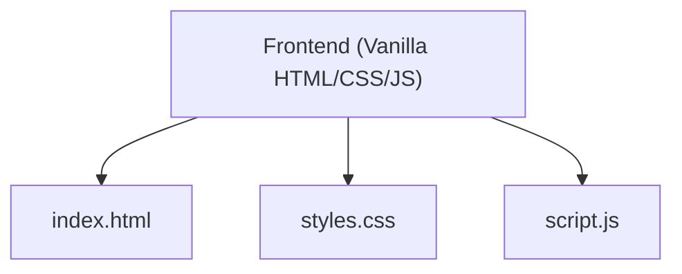

## 1. Architecture Design



## 2. Technology Description
- Frontend: Vanilla HTML5, CSS3, JavaScript (ES6+)
- No backend or database needed
- External assets: Google Fonts (Poppins, Inter)

## 3. File Structure
```
/
├── index.html
├── styles.css
└── script.js
```

## 4. Responsive Breakpoints
- Mobile: < 768px
- Tablet: 768px - 1024px
- Desktop: > 1024px
