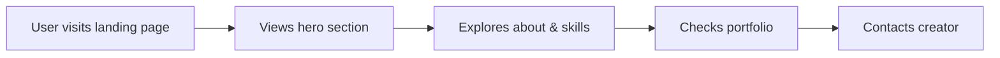

## 1. Product Overview
Creative & Playful personal portfolio landing page to showcase work, skills, and personality.
- Target users: potential clients, recruiters, and collaborators
- Goal: Make a memorable first impression and encourage contact

## 2. Core Features

### 2.2 Feature Module
1. **Home page**: hero section, about section, work/portfolio section, skills section, contact section

### 2.3 Page Details
| Page Name | Module Name | Feature description |
|-----------|-------------|---------------------|
| Home page | Hero section | Animated hero with playful typography and interactive elements |
| Home page | About section | Brief introduction with friendly tone |
| Home page | Work section | Portfolio showcase with cards |
| Home page | Skills section | Visual skill display |
| Home page | Contact section | Easy contact form or links |

## 3. Core Process
User lands on page → explores sections → views portfolio → contacts creator

## 4. User Interface Design

### 4.1 Design Style
- Primary colors: Bright coral (#FF6B6B) and soft teal (#4ECDC4)
- Secondary colors: Cream (#F7FFF7), Dark blue (#292F36)
- Buttons: Rounded, playful, with hover animations
- Fonts: Poppins (display) + Inter (body)
- Layout: Asymmetrical, overlapping elements, lots of white space
- Style: Creative, playful, with subtle animations

### 4.2 Page Design Overview
| Page Name | Module Name | UI Elements |
|-----------|-------------|-------------|
| Home page | Hero section | Large animated typography, floating shapes, gradient background |
| Home page | About section | Photo + text with playful layout |
| Home page | Work section | Grid of project cards with hover effects |
| Home page | Skills section | Colorful skill tags with animations |
| Home page | Contact section | Friendly CTA buttons and links |

### 4.3 Responsiveness
Desktop-first design, fully responsive for tablet and mobile. Optimized for touch interactions.
